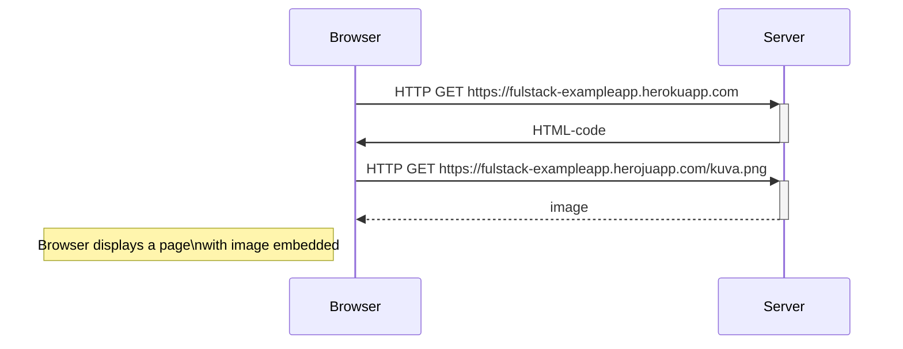

# Mermaid Flowchart Example

This README demonstrates the secuence of events for the example app requesting the picture and how the client communicates with the server.

## Diagram



- Make sure the code block starts with:

```markdown
```mermaid
```

- GitHub automatically renders Mermaid diagrams inside Markdown files like `README.md`.
