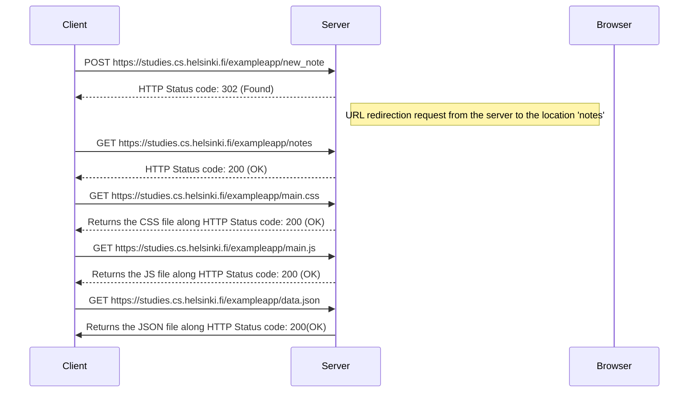

# Mermaid Flowchart Example

This README demonstrates the secuence of events for adding a new note thorugh the form.

## Diagram of adding a new note



- Make sure the code block starts with:

```markdown
```mermaid
```

- GitHub automatically renders Mermaid diagrams inside Markdown files like `README.md`.
