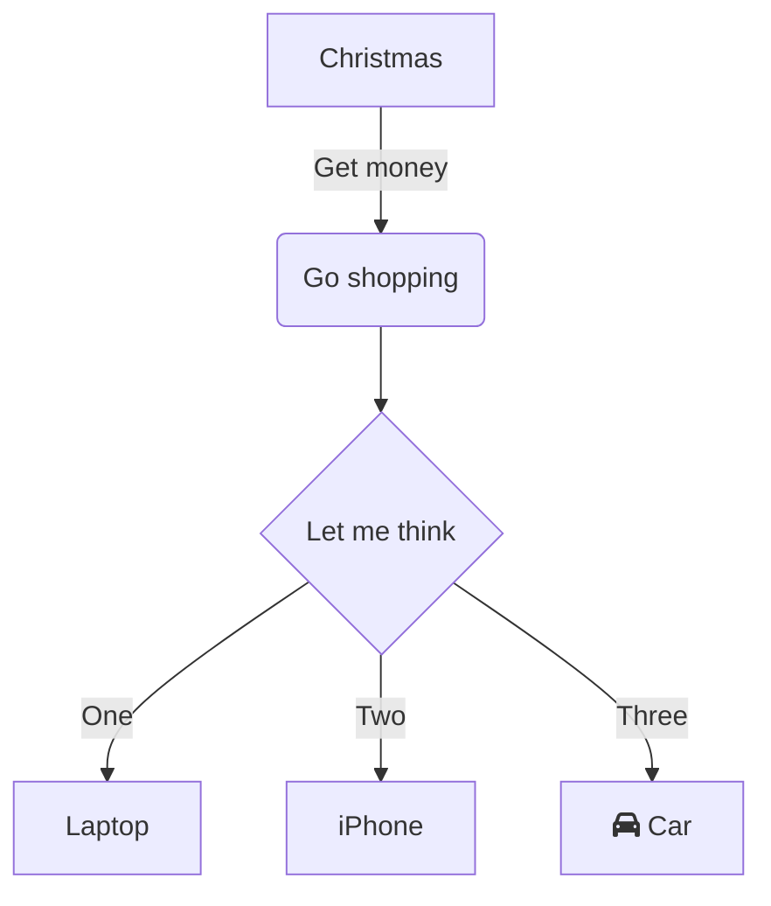

# Mermaid Flowchart Example

This README demonstrates a simple flowchart using Mermaid.

## Diagram



## Description

- **Christmas** leads to getting money.
- Then the user goes shopping.
- A decision is made between:
  - Buying a Laptop
  - Buying an iPhone
  - Buying a Car

## Notes

To render Mermaid diagrams correctly on GitHub:

- Make sure the code block starts with:

```markdown
```mermaid
```

- GitHub automatically renders Mermaid diagrams inside Markdown files like `README.md`.
