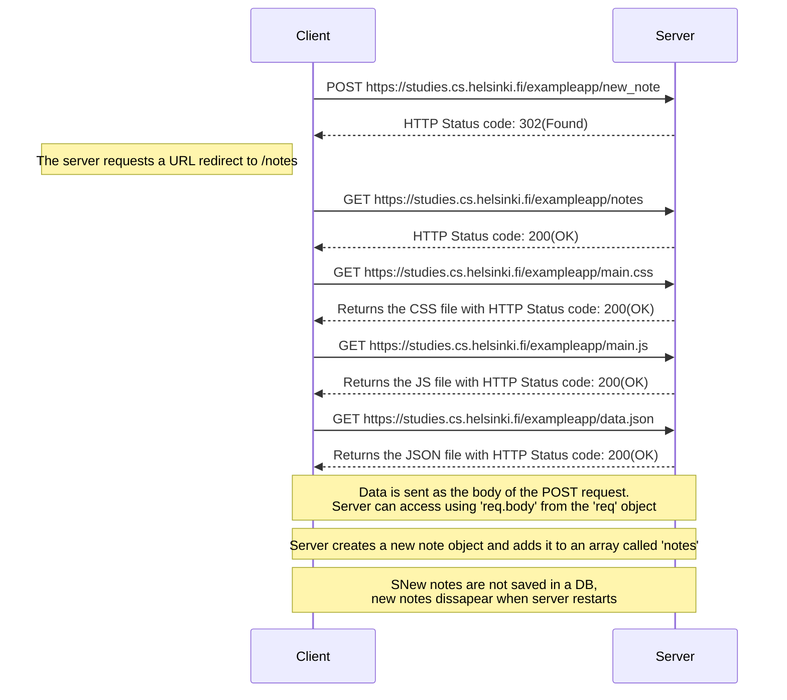

# Sequence diagram of adding a new note

This diagram demonstrates the sequence of events for adding a new note through the form.

## Diagram of adding a new note



- Make sure the code block starts with:

```markdown
```mermaid
```

- GitHub automatically renders Mermaid diagrams inside Markdown files like `README.md`.
